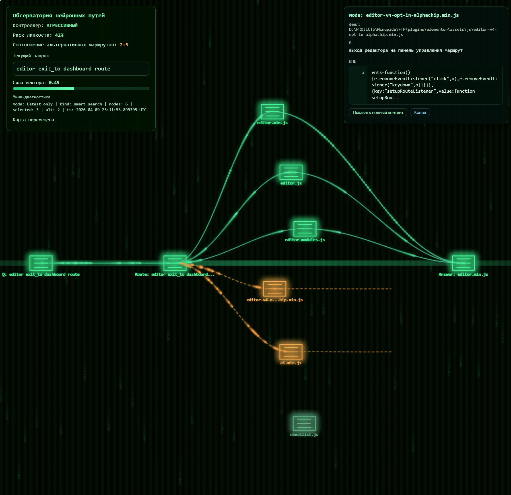

# MemPalace Neural Dashboard for Cursor

Local-first memory toolkit for Cursor: smart retrieval, route diversity control, feedback learning, and a visual dashboard that explains what is happening.



## Why This Exists

This project is built on the MemPalace idea associated with Mila Jovovich (`milla-jovovich`) and then extended into a practical day-to-day workflow for real projects.

In simple words:

- Cursor gets a memory layer.
- Memory quality is observable (you can see routes, not guess them).
- The system learns from outcomes (`helped` / `not helped`), not only from similarity.

Think of it like this:

- **Vector DB** is the library.
- **Smart search** is the librarian.
- **Dashboard** is the control room with cameras.
- **Feedback** is the training loop that makes the librarian better over time.

## What The Tool Does

- Indexes your selected folders (code and/or conversations) into MemPalace memory.
- Runs smart retrieval with anti-stickiness logic:
  - semantic relevance,
  - diversity (MMR),
  - source caps,
  - adaptive exploration.
- Logs route telemetry to analytics files.
- Shows retrieval behavior in a dashboard:
  - stickiness trend,
  - alternative-route ratio,
  - adaptive controller state,
  - neural path simulation.
- Learns from feedback:
  - `helped=yes|no|unknown`,
  - optional `minutes_saved`.

## Who This Is For

- People using Cursor in long-running projects.
- Teams that want context continuity.
- Non-programmers who still need to understand what the AI is doing.
- Whiteboarding and decision-tracking workflows where "why this answer" matters.

## Quick Start (Windows, from zero)

### 1) Prepare environment

- Open PowerShell in this folder.
- Make sure MemPalace and Python environment are available.
- If your project uses the provided venv layout, commands below work as-is.

### 2) Choose what to index (one-time)

```powershell
.\mempalace-setup-indexing.ps1
```

What happens:

- You choose folders.
- You assign each folder a `wing` name.
- Config is saved to `mempalace-indexing.json`.

### 3) Build/refresh memory index

```powershell
.\mempalace-refresh-index.ps1
```

Optional shortcuts:

```powershell
.\mempalace-refresh-child.ps1
.\mempalace-refresh-chats.ps1
.\mempalace-refresh-tooling.ps1
```

### 4) Run one smart search

```powershell
.\.venv-mempalace\Scripts\python.exe .\mempalace-smart-search.py "your query" --top-k 10 --candidate-k 40
```

This creates route telemetry in `.mempalace-analytics/`.

### 5) Start dashboard

```powershell
.\mempalace-dashboard.ps1
```

Open:

- [http://localhost:8501](http://localhost:8501)

This is the main board URL.

## Cursor Setup (Important)

To make the workflow fully useful inside Cursor, install both:

- Skill: `.cursor/skills/mempalace-neural-memory/SKILL.md`
- Rule: `.cursor/rules/mempalace-priority-workflow.mdc`

Practical setup:

1. Copy these files into your project `.cursor` folder (or keep them in this repo and reuse).
2. Ensure your Cursor workflow actually uses the skill + rule.
3. Keep feedback logging in your normal routine (see below).

Without this step, you still have scripts and dashboard, but the "learn from daily usage" loop is weaker.

## Feedback Loop (Most Important Part)

MemPalace improves when outcomes are logged.

Log feedback after meaningful tasks:

```powershell
.\mempalace-log-feedback.ps1 -Helped yes -MinutesSaved 8 -Note "The proposed route solved the issue quickly"
```

Use values:

- `-Helped yes` when result was useful.
- `-Helped no` when result was misleading.
- `-Helped unknown` when unclear.
- `-MinutesSaved` if you can estimate time impact.

Why this matters:

- Repeated helpful routes get stronger.
- Unhelpful routes get weaker.
- Ranking becomes more practical over time.

## Daily Workflow (Simple)

1. Ask Cursor your normal task question.
2. Run smart retrieval (directly or through your routine wrappers).
3. Check dashboard when needed:
  - Are routes diverse?
  - Is stickiness rising?
  - Is adaptive controller stabilizing behavior?
4. Log feedback.
5. Repeat.

Over time, the system becomes better tuned to your real project context.

## Dashboard: What To Watch First

If you are new, focus on these four:

- **Sessions with memory (unique)**  
Shows if memory is truly being used in real sessions.
- **Route events**  
Shows whether you are getting real route telemetry (`smart`) vs only heartbeat updates (`touch`).
- **Stickiness risk**  
Higher values mean retrieval repeats too much from same sources.
- **Noise level**  
Quick health state (`low` / `moderate` / `high`) for maintenance decisions.

## Suggested GitHub Repository Description

Use this short description on GitHub:

`Local-first MemPalace toolkit for Cursor: smart memory retrieval, anti-stickiness routing, feedback learning, and a visual dashboard.`

## Maintenance

Manual:

```powershell
.\mempalace-maintenance.ps1 -Mode apply
```

Automatic:

```powershell
.\mempalace-maintenance.ps1 -Mode auto
```

You can also trigger optimization from the dashboard:

- `Optimize database now`
- automatic optimization when noise threshold is exceeded (if enabled)

## File Guide

- `mempalace-smart-search.py` - smart retrieval and route selection.
- `mempalace-dashboard.py` - analytics + neural simulator UI.
- `mempalace_analytics.py` - shared analytics helpers.
- `mempalace-feedback.py` - feedback processing logic.
- `mempalace-route-pulse.py` - lightweight heartbeat events.
- `mempalace-maintenance.py` - telemetry cleanup/maintenance logic.
- `mempalace-dashboard.ps1` - dashboard launcher.
- `mempalace-setup-indexing.ps1` - interactive index setup.
- `mempalace-refresh-index.ps1` - refresh index from config.
- `mempalace-log-feedback.ps1` - log usefulness feedback.
- `.cursor/skills/mempalace-neural-memory/SKILL.md` - Cursor skill.
- `.cursor/rules/mempalace-priority-workflow.mdc` - Cursor rule.

## Privacy and Data

- Local-first design.
- Telemetry stays in `.mempalace-analytics/`.
- Vector memory is stored locally in `.mempalace-child/`.
- Do not publish local stores, private transcripts, or personal configs.

## License

This project is open source under the MIT License.
See `LICENSE` for full legal text.
